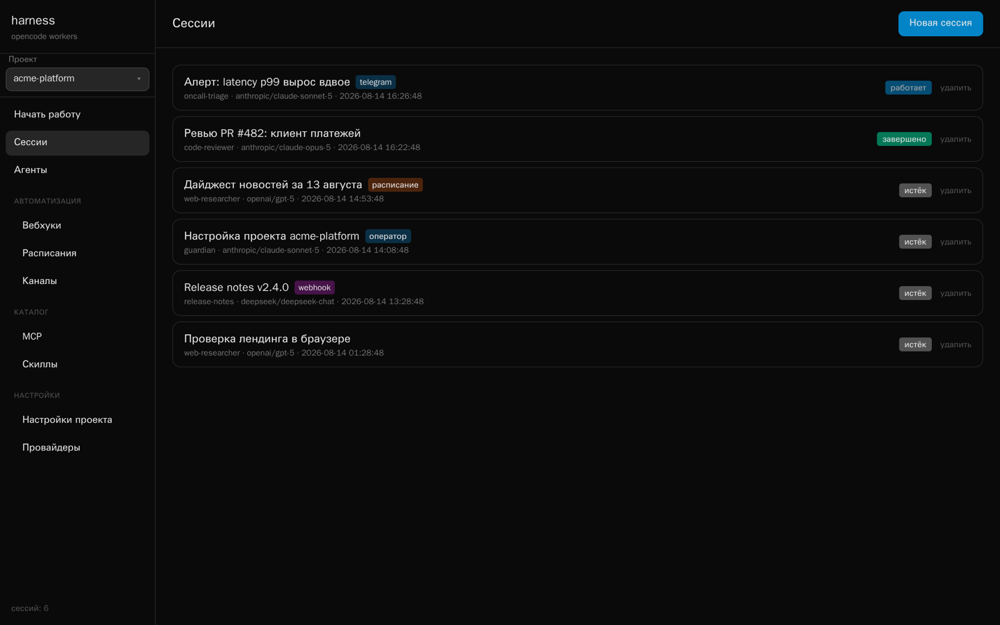
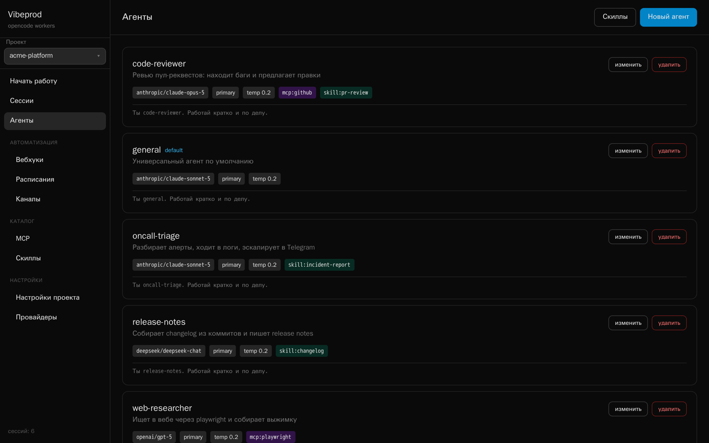
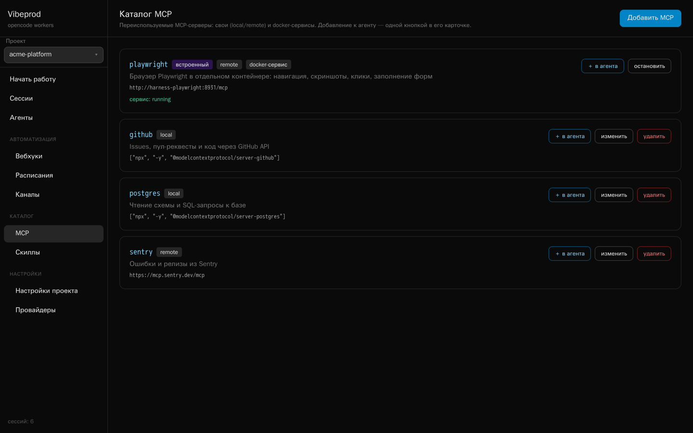
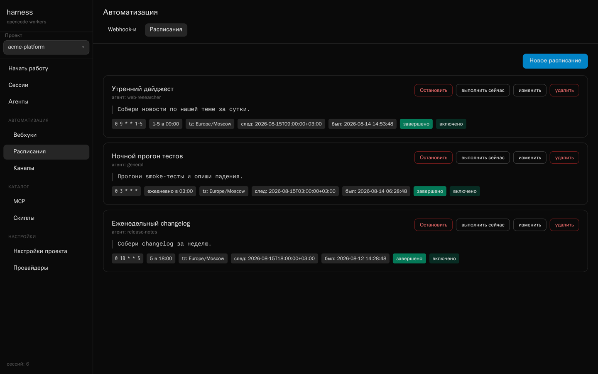
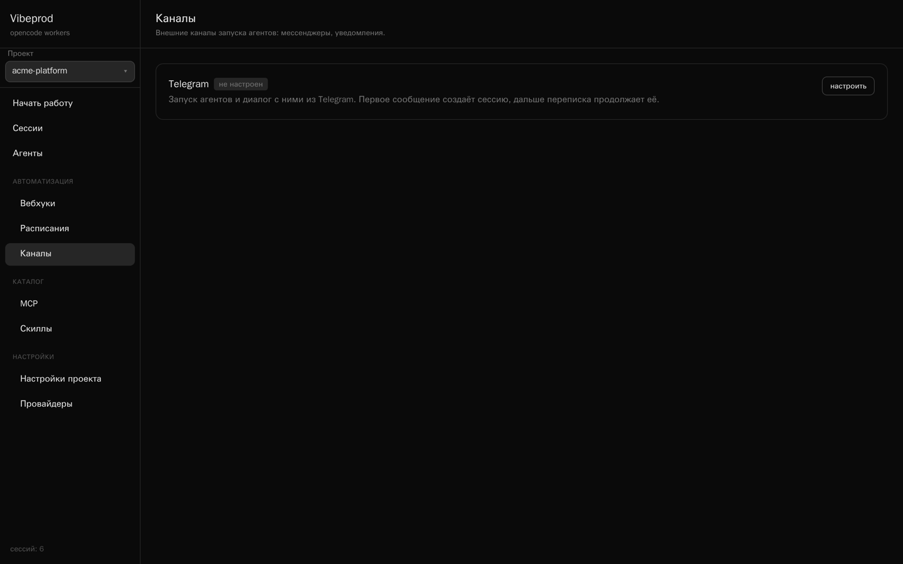
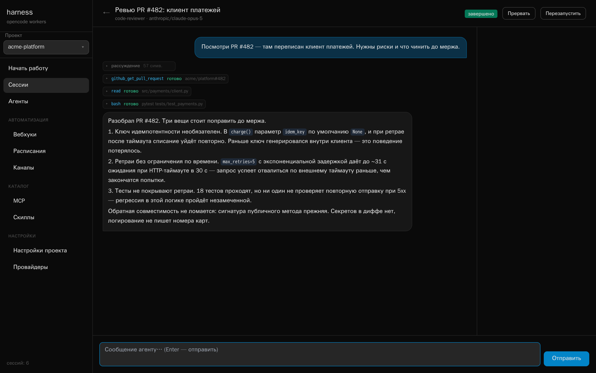
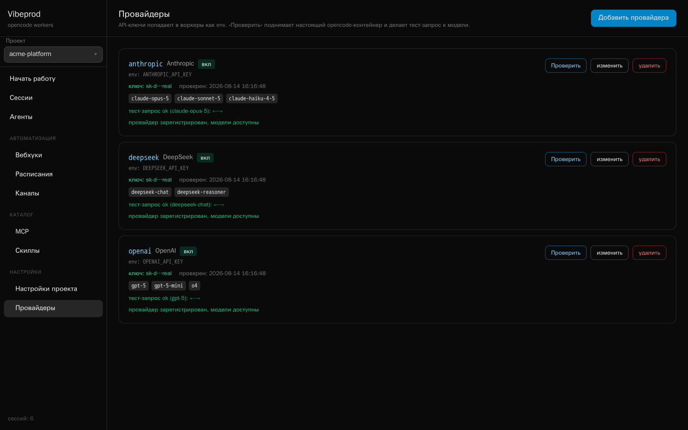

# Vibeprod

**Самостоятельно размещаемая панель управления агентами [opencode](https://github.com/sst/opencode).**
Каждый сеанс — свой docker-контейнер. Работает на вашей машине, на ваших ключах, по вашим правилам.

[](https://github.com/katskov-dev/vibeprod/actions/workflows/ci.yml)
[](LICENSE)
[](https://www.python.org/)

[English version](README.md) · [Лендинг](https://katskov-dev.github.io/vibeprod/)



---

## Что это

opencode — отличный терминальный агент. Vibeprod — слой вокруг него, который
нужен, когда агентов становится больше одного: веб-интерфейс над всеми сеансами
сразу, агенты, описанные один раз и переиспользуемые, cron-расписания, входящие
и исходящие вебхуки, канал в Telegram и общий каталог MCP. Всё это — один
процесс FastAPI и файл sqlite рядом с ним.

Внутри примерно 6 000 строк питона и фронтенд без единой зависимости. Ни сборки,
ни очереди сообщений, ни кубернетеса.

**Чем отличается от облачных агентских продуктов:** расписания, вебхуки и
мессенджер-каналы здесь встроены и работают локально. Чтобы агент запускался в
09:00 по будням и присылал результат в Telegram, не нужен облачный тариф — и ни
код, ни ключи не покидают вашу машину.

> [!WARNING]
> **У брокера нет аутентификации, и он управляет докер-демоном.** Любой, кто
> дотянется до его порта, может выполнить код с правами root на хосте. Именно
> поэтому compose публикует порт только на `127.0.0.1`. Прочитайте
> [SECURITY.md](SECURITY.md), прежде чем ставить это на сервер.

## Быстрый старт

Нужен docker и Python 3.11+ (или только docker).

```bash
git clone https://github.com/katskov-dev/vibeprod.git
cd vibeprod
cp .env.example .env     # впишите хотя бы один ключ провайдера
./run.sh                 # → http://localhost:8000
```

Или в контейнере:

```bash
docker compose up --build
```

Первый запуск подтягивает запиненный образ `ghcr.io/anomalyco/opencode`
(версия зафиксирована в compose.yaml и worker/Dockerfile) и собирает поверх
него образ воркера — opencode плюс лёгкий набор для кодинг-агентов:
python3/pip, curl, jq, git, ripgrep, bash, make, zip, openssh (без
компиляторов, чтобы не раздувать образ).

Откройте интерфейс, опишите задачу на главном экране — и **агент-оператор**
настроит проект сам: создаст агентов, подключит MCP-серверы и скиллы, добавит
провайдеров, вебхуки и расписания. Делает он это через отдельный MCP-сервер,
живущий внутри брокера.

## Деплой

Требования к серверу: Linux, docker + docker compose v2, git, `curl`.
Ставьте из репозитория — так фиксы можно откатить и заносить обратно в репо:

```bash
git clone https://github.com/katskov-dev/vibeprod.git /srv/vibeprod
cd /srv/vibeprod
bash scripts/setup.sh
```

`setup.sh` проверяет docker, генерирует `.env` со случайными паролями MinIO и
UI, спрашивает LLM-ключи (нужен хотя бы один), поднимает
`docker compose up -d --build` и печатает URL и креды. После этого проверьте
деплой целиком:

```bash
bash scripts/smoke.sh    # health → логин → сессия → воркер → ответ LLM → статус
```

Важно про сеть: брокер в compose работает в `network_mode: host` — это
**обязательно**. Брокер ходит в воркеры по `127.0.0.1:<host-port>`, а внутри
bridge-сети `127.0.0.1` — это loopback самого брокера, а не хоста: все сессии
падают с «opencode serve не поднялся». По той же причине (в host-режиме нет DNS
контейнеров) MinIO публикуется на loopback хоста (`127.0.0.1:9000`). Порт
брокера при host-сети — это просто bind uvicorn'а: `setup.sh` включает
`VIBEPROD_BIND=0.0.0.0` вместе с авторизацией UI (прочитайте
[SECURITY.md](SECURITY.md) — без авторизации это root-шелл на хосте). Готовность
сервисов: `docker compose ps` (у обоих healthcheck) или
`docker compose up --wait`.

Обновление: `cd /srv/vibeprod && git pull && docker compose up -d --build`
(образ воркера пересоберётся автоматически на следующей сессии, если изменился
`worker/Dockerfile`).

### Типовые ошибки деплоя

| Симптом | Причина | Лечение |
|---|---|---|
| Сессии падают с «opencode serve не поднялся» | Брокер не видит порт воркера на `127.0.0.1` — нет `network_mode: host` | Используйте compose.yaml как есть (`network_mode: host` обязателен); `docker compose config` покажет, что реально деплоится |
| Probe-контейнеры падают с «bind source path does not exist» | Не задан `VIBEPROD_HOST_DATA_DIR`: docker-демон резолвит source bind-mount на хосте, а не внутри брокера | compose подставляет `VIBEPROD_HOST_DATA_DIR=${PWD}/data`; вне compose задайте явно |
| Каталог провайдеров пуст / «Проверить» падает (502) | MinIO или docker недоступны из брокера | `curl http://127.0.0.1:9000/minio/health/live` на хосте; `VIBEPROD_S3_ENDPOINT` должен быть `http://127.0.0.1:9000` (дефолт compose) |
| `docker compose ps` показывает брокер unhealthy | Из брокера не виден docker-демон или MinIO | `docker info` на хосте; проверьте mount `/var/run/docker.sock`; `curl …/api/health` покажет флаги `docker`/`s3` |
| Сессии падают, хотя раньше всё работало | Нет LLM-ключей | `/api/health` проверяет только инфраструктуру; ключи — в `.env`/UI. `scripts/smoke.sh` без `SMOKE_SKIP_LLM=1` это отловит |

## Как устроено

```
Браузер ⇄ WebSocket ⇄ FastAPI (брокер, sqlite)
                          │ Docker SDK
                          ▼
     контейнер `opencode serve` на каждый сеанс
     (изолированный workspace, том для истории,
      SSE /event ретранслируется в WebSocket)
```

**Сеанс** = контейнер + сессия opencode. История диалога лежит в docker-томе
`vibeprod-oc-<id>`, поэтому воркер можно перезапустить, не потеряв переписку. По
TTL простоя контейнер убивается, сессия помечается `expired` — данные остаются в
базе до удаления.

Каждый воркер слушает случайный порт хоста под HTTP basic auth со случайным
токеном на сеанс.

## Возможности

### Агенты, скиллы и MCP



Агенты — строки в sqlite: модель, mode, temperature, permissions, системный
промпт, плюс привязанные MCP-серверы и скиллы. При старте сеанса `render.py`
собирает нативный `opencode.json`, `.opencode/agent/*.md` и
`.opencode/skills/*/SKILL.md` в workspace воркера. Никакого проприетарного
формата: воркер видит обычный конфиг opencode.



**Каталог MCP** хранит переиспользуемые серверы двух видов. *generic* — обычные
local (команда) или remote (URL). *service* — docker-контейнеры в сети
`vibeprod-mcp`; встроенный **playwright** даёт любому агенту настоящий браузер и
поднимается автоматически, когда нужен сессии. Добавление к агенту — одна кнопка.

### Файлы проектов (MinIO)

У каждого проекта своё хранилище файлов в **MinIO** (раздел «Файлы» в меню).
Загружать файлы можно из интерфейса, а агенты делают это через MCP **files** из
каталога (подключение — одной кнопкой): инструмент `upload_file` заливает
локальный файл воркера в проект и возвращает публичную ссылку. Вместе со
скиллом **screenshot-to-files** и playwright это даёт флоу «скриншот →
файлы проекта → ссылка в ответе».

MinIO поднимается compose: `docker compose up -d minio` (порты 9000/9001 — только
loopback). Доступ брокера настраивается через `VIBEPROD_S3_ENDPOINT`,
`VIBEPROD_S3_ACCESS_KEY`, `VIBEPROD_S3_SECRET_KEY` (в compose подставляются
автоматически). Ссылки на файлы для агентов строятся от `VIBEPROD_BROKER_URL`
(по умолчанию `http://host.docker.internal:8000`).

### Автоматизация: расписания, вебхуки, Telegram



**Расписания** — cron-выражения с таймзоной. Каждый запуск порождает обычную
сессию с меткой «расписание», результат пишется в `schedule_runs`.

**Вебхуки** позволяют запускать агента из внешних систем:

```bash
curl -X POST http://localhost:8000/api/webhooks/pr-review/run \
     -H 'X-Webhook-Secret: ...' \
     -H 'Content-Type: application/json' \
     -d '{"prompt": "Проверь diff в PR #482"}'
```

`?wait=<сек>` — дождаться завершения и получить результат прямо в ответе, вместо
опроса.

**Исходящие вебхуки** шлют события брокера в ваши системы (Автоматизация →
«Исходящие»). Подпишите URL на события вроде `session.completed`,
`session.failed`, `schedule.fired` или `webhook.received` — брокер будет
присылать на него POST:

```json
{
  "event": "session.completed",
  "timestamp": "2026-08-15T09:00:00Z",
  "data": {"id": "...", "title": "Проверка PR #482", "status": "completed", "result_text": "…"}
}
```

Запросы несут заголовки `X-Vibeprod-Event` и `X-Vibeprod-Delivery`, а при
заданном секрете — подпись `X-Vibeprod-Signature: sha256=<hex>` (HMAC-SHA256 от
сырого тела). Доставка повторяется с бэкoффом (1с → 5с → 15с → 60с → 300с) при
сетевых ошибках, 429 и 5xx; каждая попытка попадает в журнал доставок с кодом
ответа и ошибкой.



**Telegram** живёт внутри брокера на long-polling — без новых зависимостей и без
публичного URL. Токен бота и разрешённые user id настраиваются в интерфейсе.
Первое сообщение открывает сессию, следующие продолжают её, ответ агента
дописывается правками в сообщение бота. Команды: `/agents`, `/agent N`, `/new`,
`/abort`, `/status`, `/link`, `/chatid`. Если задать чат для уведомлений (id
сообщит бот по команде `/chatid`), туда будут приходить сводки о завершении
запусков по расписанию и вебхукам — на каждый запуск или только при ошибке.

Кроме того, у **каждого агента** есть встроенные инструменты Vibeprod
(remote-MCP `vibeprod` внутри каждой сессии): `telegram_send` — написать
пользователю в Telegram, `telegram_send_file` — прислать файл (из workspace
воркера или текстом), `telegram_info` — статус канала. Удобно для уведомлений
из расписаний: агент отработал задание и сам отправил результат и файлы в чат.

### Живые сессии



Брокер читает SSE воркера и рассылает в `WS /ws/sessions/{id}`. Вызовы
инструментов, блоки рассуждений и списки задач появляются по мере выполнения;
компактные события пишутся в sqlite, полный транскрипт сохраняется по
`session.idle`.

### Провайдеры



Ключи провайдеров задаются в интерфейсе и имеют приоритет над `*_API_KEY` из
окружения брокера. Кнопка **«Проверить»** поднимает короткоживущий
probe-контейнер с тем же образом opencode и вашим ключом, проверяет регистрацию
провайдера, список моделей и делает настоящий тест-запрос — ровно то, что
произойдёт в воркере.

## Сравнение с аналогами

Честно о позиционировании: Vibeprod — небольшой self-hosted проект, а не
конкурент профинансированным платформам по широте и зрелости. Он выигрывает по
одной оси — *автоматизация на своём железе без облачного тарифа* — и проигрывает
по другой: *здесь вообще нет аутентификации и многопользовательского режима*.

| | **Vibeprod** | [OpenHands](https://github.com/OpenHands/OpenHands) | [opencode](https://github.com/sst/opencode) | [Goose](https://github.com/block/goose) | Devin · Jules · Codex cloud · Cursor agents |
|---|---|---|---|---|---|
| Лицензия | MIT | MIT | MIT | Apache-2.0 | Проприетарные |
| Self-hosted | Единственный вариант | Да (+ облако) | Да | Да | Нет |
| Веб-интерфейс над многими сеансами | ✅ | ✅ | ❌ (TUI + serve API) | ❌ (десктоп/CLI) | ✅ у вендора |
| Контейнер на сеанс | ✅ | ✅ | ❌ на хосте | ❌ на хосте | ✅ песочница вендора |
| Cron-расписания | ✅ встроены | ☁️ облачный тариф | ❌ | ❌ | ⚠️ по-разному |
| Входящие вебхуки | ✅ встроены | ☁️ облачный тариф | ❌ | ❌ | ⚠️ по-разному |
| Исходящие вебхуки | ✅ встроены | ⚠️ по-разному | ❌ | ❌ | ⚠️ по-разному |
| Канал в мессенджере (Telegram) | ✅ | ❌ | ❌ | ❌ | ❌ |
| Поддержка MCP | ✅ + общий каталог | ✅ | ✅ | ✅ | ⚠️ по-разному |
| Агент настраивает саму платформу | ✅ guardian MCP | ❌ | ❌ | ❌ | ❌ |
| Свои ключи (BYOK) | ✅ | ✅ | ✅ | ✅ | ❌ подписка |
| Работа с git и пул-реквестами | ⚠️ через агента и git | ✅ из коробки | ✅ из коробки | ✅ | ✅ из коробки |
| Аутентификация, многопользовательский режим, RBAC | ❌ **нет** | ✅ enterprise | — | — | ✅ |
| Зрелость | 🌱 ранняя | Крупный, с инвестициями | Очень крупный | Linux Foundation | Коммерческие |

**Берите Vibeprod, если** нужны агенты на своём железе, запускаемые по cron,
вебхукам и из чата, с изоляцией по сеансам и ключами, которые никуда не уходят.

**Берите что-то другое, если** нужны разграничение доступа, размещённый сервис с
SLA или зрелый процесс ревью пул-реквестов.

## Настройка

| Переменная | По умолчанию | Назначение |
|---|---|---|
| `VIBEPROD_DATA_DIR` | `./data` | sqlite + workspaces (путь внутри брокера) |
| `VIBEPROD_HOST_DATA_DIR` | `= VIBEPROD_DATA_DIR` | тот же каталог в системе координат докер-демона. Нужен, когда брокер сам в контейнере |
| `VIBEPROD_OPENCODE_IMAGE` | `vibeprod-opencode:latest` | образ воркера, собирается из `worker/` при первом запуске |
| `VIBEPROD_WORKER_BUILD_DIR` | `./worker` | контекст сборки образа воркера |
| `VIBEPROD_IDLE_TTL_MIN` | `120` | минут простоя до убийства воркера |
| `VIBEPROD_PORT` | `8000` | порт брокера |
| `VIBEPROD_BIND` | `127.0.0.1` | интерфейс uvicorn'а; при `network_mode: host` это фактически публикация порта. `0.0.0.0` — только вместе с `VIBEPROD_LOGIN`/`VIBEPROD_PASSWORD` |
| `VIBEPROD_TZ` | `Europe/Moscow` | таймзона cron-расписаний |
| `VIBEPROD_GUARDIAN_URL` | `http://host.docker.internal:<порт>/guardian/mcp` | URL guardian MCP так, как его видят воркеры |
| `VIBEPROD_LOGIN` · `VIBEPROD_PASSWORD` | — | логин и пароль для входа в веб-интерфейс. Оба пусты — вход не требуется |
| `TELEGRAM_BOT_TOKEN` · `TELEGRAM_ALLOWED_USERS` · `TELEGRAM_WEB_URL` | — | фолбэк на первый запуск, если в интерфейсе ничего не настроено |
| `*_API_KEY` | — | прокидываются внутрь воркеров |

Аннотированная версия — в [.env.example](.env.example).

## API

```
GET/POST   /api/projects              PUT/DELETE /api/projects/{id}
GET/POST   /api/agents                PUT/DELETE /api/agents/{id}
POST/PUT/DELETE /api/agents/{id}/mcp[/{mid}]     PUT /api/agents/{id}/skills
GET/POST   /api/skills                PUT/DELETE /api/skills/{id}
GET/POST   /api/providers             PUT/DELETE /api/providers/{id}
POST       /api/providers/{id}/check          probe-контейнер: регистрация + модели + тест-запрос
GET/POST   /api/mcp-catalog           PUT/DELETE /api/mcp-catalog/{id}
POST       /api/mcp-catalog/{id}/start|stop   docker-сервисы
POST       /api/mcp-catalog/{id}/attach       {agent_id}
GET/POST   /api/webhooks              PUT/DELETE /api/webhooks/{id}
POST       /api/webhooks/{slug}/run           тело {prompt?, title?}, X-Webhook-Secret, ?wait=<сек>
GET/POST   /api/out-webhooks          PUT/DELETE /api/out-webhooks/{id}
GET        /api/out-webhooks/events
POST       /api/out-webhooks/{id}/test        отправить webhook.test на URL
GET        /api/out-webhooks/{id}/deliveries  журнал доставок (статус, HTTP-код, попытки)
POST       /api/out-webhooks/{id}/deliveries/{did}/retry
GET        /api/channels
GET/PUT/DELETE /api/telegram          POST /api/telegram/test {token}
GET/POST   /api/sessions              POST /api/sessions/{id}/prompt|abort|restart
GET        /api/sessions/{id}/messages        DELETE /api/sessions/{id}
WS         /ws/sessions/{id}
GET/POST   /api/schedules             PUT/DELETE /api/schedules/{id}
POST       /api/schedules/{id}/run-now        GET /api/schedules/{id}/runs
POST       /guardian/mcp                      JSON-RPC поверх streamable HTTP, только с Bearer-секретом
```

Большинство коллекций принимает `?project_id=` для фильтрации.

## Устранение неполадок

**WebSocket не подключается, локальные запросы отдают 503.**
Брокер ходит в воркеры по `127.0.0.1`. Если включён системный HTTP-прокси
(macOS: `scutil --proxy`), python-клиенты и браузер маршрутизируют loopback через
него. Добавьте `127.0.0.1,localhost` в `no_proxy` и в исключения системного
прокси.

**Ошибка `Model not found: provider/model`.**
opencode регистрирует модели провайдера только при наличии API-ключа. Проверьте,
что ключ доехал до воркера, — кнопка «Проверить» на странице «Провайдеры»
проходит ровно этот путь и показывает полученный список моделей.

## Участие в разработке

См. [CONTRIBUTING.md](CONTRIBUTING.md). Тесты: `pytest -q` (докер и ключи не
нужны).

## Лицензия

MIT — см. [LICENSE](LICENSE). © 2026 Pavel Katskov.

Построено на [opencode](https://github.com/sst/opencode) от Anomaly Innovations,
тоже MIT.
